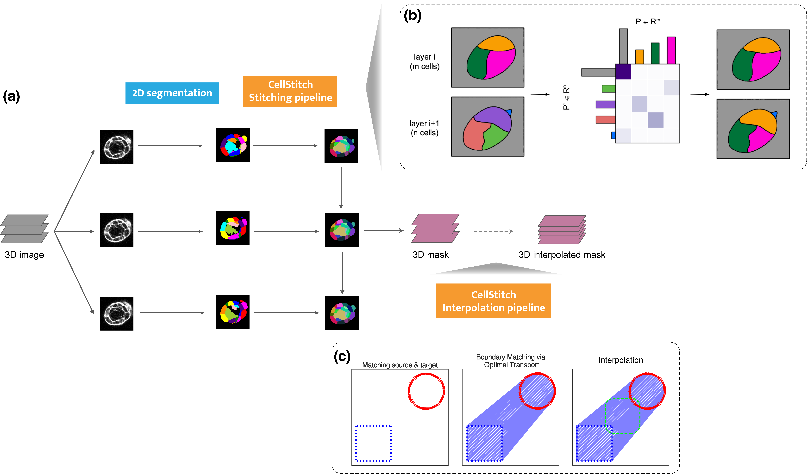

# CellStitch: 3D Cellular Segmentation via Optimal Transport 
 

## Installation
```bash
git clone https://github.com/imyiningliu/cellstitch.git
cd cellstitch
pip install -e .
```

## Instructions
Our implementation of the algorithm is in `./cellstitch/`; you can git clone our repository and install the package locally. Example usage can be found [here](https://github.com/imyiningliu/cellstitch/blob/main/notebooks/example.ipynb). 
